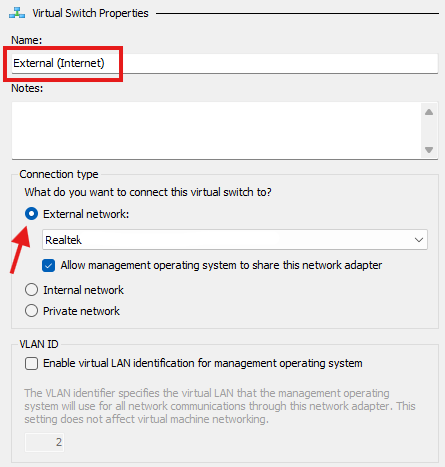
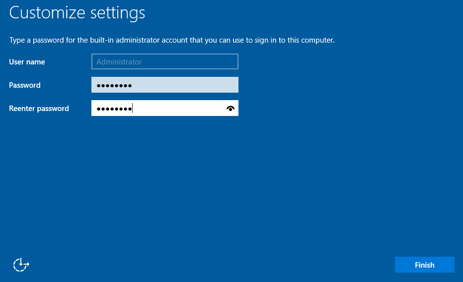
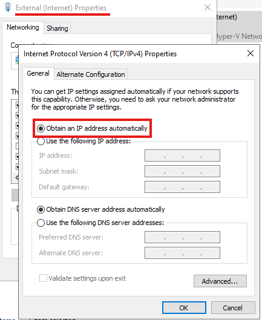
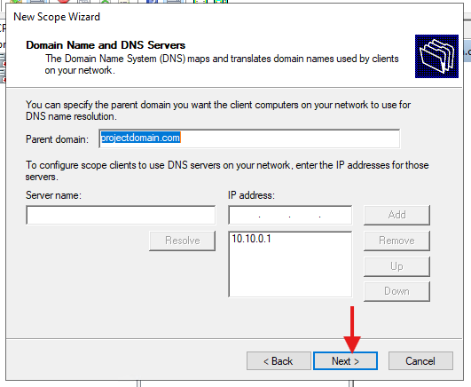
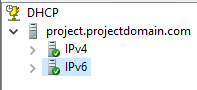
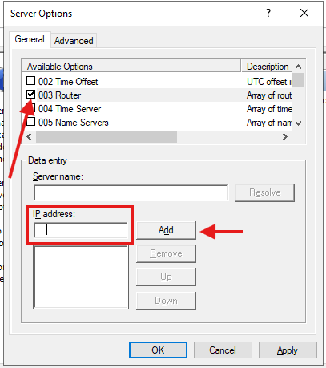
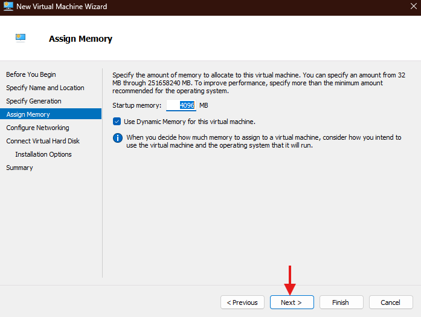
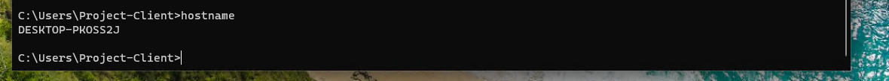

# Windows Server 2022 Active Directory Hyper-V Lab Setup

This project demonstrates the step-by-step setup of a virtualized Windows Server 2022 Active Directory environment using Hyper-V. The lab simulates a real-world IT infrastructure by integrating Windows 11 clients and configuring essential services like Active Directory Domain Services (AD DS), DHCP, and Routing with NAT.

---

### **What This Project Consists Of**
- **Virtualized Environment**: Built using Hyper-V to host both the Windows Server 2022 and Windows 11 Pro Client VMs.  
- **Domain Controller Setup**: Configured to manage users, groups, and resources using Active Directory.  
- **Networking Configuration**: Includes static IP assignment for the server, DHCP for dynamic IP management, and NAT for internet routing.  
- **Client Integration**: A Windows 11 Pro client joined to the domain to simulate a workstation in a business environment.  
- **Active Directory Management**: Organized users into Organizational Units (OUs), assigned roles, and applied group policies.  
- **Testing and Troubleshooting**: Verified connectivity, domain integration, and policy enforcement through practical testing scenarios.

## Disclaimer  
This project was created as part of my learning journey to deepen my understanding of Windows Server administration, Active Directory configurations, and virtualization using Hyper-V. While I’ve taken care to ensure accuracy, this guide reflects my current knowledge and may evolve as I continue to learn. Constructive feedback and suggestions are always welcome!

## **Table of Contents**

🧰 [Requirements](#-requirements)
1. [Installing Hyper-V](#1-installing-hyper-v)  
2. [Creating Virtual Network Interfaces (vNICs)](#2-creating-virtual-network-interfaces-vnics)  
3. [Creating the Server Virtual Machine (VM)](#3-creating-the-server-virtual-machine-vm)  
4. [Assigning Internal and External NICs to the Server VM](#4-assigning-internal-and-external-nics-to-the-server-vm)  
5. [Installing Windows Server 2022](#5-installing-windows-server-2022)  
6. [Customizing Windows Server 2022](#6-customizing-windows-server-2022)
7. [Configuring NIC IP Settings](#7-identifying-and-configuring-nic-ip-settings)
8. [Assigning Server Roles](#8-assigning-server-roles)  
9. [Promoting the Server to a Domain Controller](#9-promoting-the-server-to-a-domain-controller)  
10. [Configuring Routing with NAT](#10-configuring-routing-with-nat)  
11. [Configuring the DHCP Scope](#11-configuring-the-dhcp-scope)  
12. [Creating the Client VM](#12-creating-the-client-vm)  
13. [Installing Windows 11 Pro Client](#13-installing-windows-11-pro-client)  
14. [Joining a Client to the Domain](#14-joining-a-client-to-the-domain)  
15. [Organizing OUs, Creating Accounts, and Managing Group Assignments in AD](#15-organizing-ous-creating-accounts-and-managing-group-assignments-in-ad)  
16. [Verifying Client Network Connectivity and IP Configuration](#16-verifying-client-network-connectivity-and-ip-configuration)
17. [Troubleshooting](#17-troubleshooting)  
   17.1 [Issue1](#171-common-account-lockout-issues)  
   17.2 [Issue2](#172-dns-configuration-problems)  
   17.3 [Issue3](#173-group-policy-not-applying)
 
----

# 🧰 Requirements  

### **Host Machine Requirements** - [How to Enable Hyper-V](https://learn.microsoft.com/en-us/virtualization/hyper-v-on-windows/quick-start/enable-hyper-v)

To run the virtualized environment using **Hyper-V**, ensure your host machine meets the following requirements:  
- **Processor**: 64-bit CPU with **SLAT (Second Level Address Translation)** support.  
- **Memory**: 16 GB RAM (minimum).  
- **Storage**: At least 100 GB of free disk space for virtual machines.  
- **Operating System**: Windows 10/11 Pro or Enterprise (with Hyper-V enabled).  
- **Virtualization Support**: Enable virtualization in BIOS/UEFI.  

___

### **Windows Server 2022 VM Requirements** - [Download Windows Server 2022 ISO](https://www.microsoft.com/en-us/evalcenter/evaluate-windows-server-2022)

- **Processor**: 1.4 GHz 64-bit processor or higher.  
- **Memory**: 4 GB RAM (minimum).  
- **Storage**: 40 GB disk space (recommended for a lab environment).  
- **Network**: At least 1 virtual network adapter (internal or external).  

___

### **Windows 11 Client VM Requirements** - [Download Windows 11 ISO](https://www.microsoft.com/en-us/software-download/windows11)  

- **Processor**: 1 GHz dual-core 64-bit CPU.  
- **Memory**: 4 GB RAM (minimum).  
- **Storage**: 64 GB disk space (minimum).  
- **Graphics**: DirectX 12 compatible GPU / WDDM 2.0 driver.  
- **Network**: At least 1 virtual network adapter.  

---

# **1. Installing Hyper-V**

*Assuming you have virtualization enabled already in your BIOS/UEFI settings. If not, you will need to enable it first through your system settings.*
Install **Hyper-V** on your host machine by following the steps in this guide: [Enable Hyper-V on Windows](https://learn.microsoft.com/en-us/virtualization/hyper-v-on-windows/quick-start/enable-hyper-v).  

---

# **2. Creating Virtual Network Interfaces (vNICs)**

In this step, we will create two virtual network interfaces (vNICs) in Hyper-V:  
- The **Internet vNIC** will enable the server to access the internet and share connectivity with client devices.  
- The **Office vNIC** will allow internal communication between the server and client devices within a private network.  

These vNICs work together to simulate a real-world network, with the server acting as a gateway for internet access and managing internal office communications.

## **Step 2.1**  
In **Hyper-V Manager**, click on **`Virtual Switch Manager`**.  

> [!NOTE]  
> The **Virtual Switch Manager** is where you configure virtual network switches, which connect your VMs to networks.

## **Step 2.2**  
Select **`External`** for the type of switch and click **`Create Virtual Switch`**.  

> [!TIP]  
> - **External**: Connects VMs to your host machine and the internet.  
> - **Internal**: Connects VMs to the host machine only, without internet.  
> - **Private**: Connects VMs to each other but not to the host or internet, ideal for isolated communication.

## **Step 2.3**  
Name the switch appropriately (e.g., **External (Internet)**). For the connection type, select **`External`** and choose your physical NIC from the dropdown.  

> [!IMPORTANT]  
> Ensure the correct physical NIC is selected to avoid connectivity issues. This vNIC will provide internet access to the server and other VMs.

## **Step 2.4**  
To create the Office NIC, click **`New Virtual Network Switch`** and select **`Private`** for the type. Click **`Create`**.  

> [!TIP]  
> - **External**: Connects VMs to your host machine and the internet.  
> - **Internal**: Connects VMs to the host machine only, without internet.  
> - **Private**: Connects VMs to each other but not to the host or internet, ideal for isolated communication.

  

## **Step 2.5**  
Name the switch appropriately (e.g., **Office vNIC**). For the connection type, select **`Private Network`** and click **`OK`**.  

> [!NOTE]  
> A **Private Network** switch ensures secure communication between VMs without exposing them to the host or external networks.

---

# **3. Creating the Server Virtual Machine (VM)**

In this step, we will create a new virtual machine in **Hyper-V** to serve as your **Windows Server 2022 Domain Controller**.

## **Step 3.1**  
In **Hyper-V Manager**, click **`New > Virtual Machine`**.  

## **Step 3.2**  
Enter a name for your virtual machine (e.g., **`Project-Server`**) and click **`Next`**.   

## **Step 3.3**  
Select **`Generation 2`** for the virtual machine and click **`Next`**.  

> [!TIP]  
> Choose **Generation 2** to take advantage of modern hardware features like UEFI and Secure Boot.

## **Step 3.4**  
Assign **`4096 MB`** (4 GB) of memory to meet the minimum RAM requirement for Windows Server.  
Check **`Use Dynamic Memory`** to allow the server to adjust RAM usage based on demand.  

> [!IMPORTANT]  
> Dynamic Memory ensures efficient use of resources, especially in environments with multiple VMs.  

## **Step 3.5**  
Select the **Private (Office) NIC** you configured earlier for the virtual machine’s network connection.  

## **Step 3.6**  
Leave the virtual hard disk (VHD) settings as default, as the default capacity exceeds the minimum storage requirement for Windows Server.  

## **Step 3.7**  
Under **`Installation Options`**, choose **`Install an operating system from a bootable CD/DVD-ROM`**, then click **`Browse`** and select your saved **Windows Server 2022 ISO file**.  

> [!NOTE]  
> Ensure the ISO file is correctly downloaded and verified to prevent installation errors.  

## **Step 3.8**  
Review the VM summary to ensure all configurations are correct, then click **`Finish`** to create the virtual machine.  

---

# **4. Assigning Internal and External NICs to the Server VM**

In this step, you will configure the virtual machine (VM) you just created by assigning the appropriate network interfaces:  
- **Private (Office):** Used for internal communication between virtual machines.  
- **External (Internet):** Enables internet access via the physical NIC.

## **Step 4.1**  
Right-click on the virtual machine you just created and select **`Settings`**.  

## **Step 4.2**  
Under **Network Adapter**, ensure the selected adapter is set to **Private (Office)**. Press **`OK`**.  

> [!NOTE]  
> The **Private (Office)** NIC is essential for internal network communication between virtual machines.

## **Step 4.3**  
Click **`Add Hardware`**, select **`Network Adapter`**, and press **`Add`** to add another network adapter.  

> [!IMPORTANT]  
> Adding an additional NIC is crucial for enabling internet connectivity through the external network.

## **Step 4.4**  
Under the new **Network Adapter**, select **External (Internet)** as the network type. Ensure you now have two active vNICs:  
- **Private (Office):** Used for internal communication.  
- **External (Internet):** Enables internet access.  

> [!TIP]  
> Double-check your NIC assignments to avoid connectivity issues. Both NICs should be correctly configured to fulfill their intended roles.

---

# **5. Installing Windows Server 2022**

In this step, we will install **Windows Server 2022** on the VM (**`Project-Server`**) you created earlier. This installation will prepare the server to function as the domain controller for your network.

## **Step 5.1**  
Right-click on your server VM (**`Project-Server`**) in **Hyper-V Manager** and select **`Connect`**. You will see a boot screen prompting you to boot from the CD/DVD. Follow the on-screen instructions to start the installation.  

> [!TIP]  
> If the VM does not boot automatically from the CD/DVD, check the boot order in the VM's settings to ensure the ISO is set as the primary boot device.

---

## **Step 5.2**  
Configure the installation options (e.g., language, time, and keyboard preferences) to your liking and click **`Next`** to proceed with the installation.  

> [!NOTE]  
> Ensure these settings match your regional and administrative preferences for easier management later.

  

---

## **Step 5.3**  
For this project, choose **Standard Evaluation (Desktop Experience)** and click **`Next`**. The **Desktop Experience** option provides a user-friendly Graphical User Interface (GUI), making it easier to follow along and manage the server throughout the project.

> [!TIP]  
> - **Standard Evaluation**: A basic edition with limited features, suitable for small to medium-sized environments.  
> - **Datacenter Evaluation**: A feature-rich edition designed for large-scale virtualization and enterprise data centers.  
> - **Desktop Experience**: Includes a GUI for easier navigation and management.  
> - **Non-Desktop Experience (Server Core)**: A minimal installation without a GUI, intended for advanced users who prefer command-line tools or remote management.

---

## **Step 5.4**  
Since this is a fresh installation, select **`Custom`** when prompted for the installation type.  

> [!IMPORTANT]  
> Selecting **Custom** is necessary for new installations, as it allows you to define the target drive and installation parameters.

---

## **Step 5.5**  
Select the drive to install Windows Server 2022, click **`Next`**, and allow the installation to proceed.  

> [!NOTE]  
> Ensure the selected drive has enough storage space to meet the minimum requirements for Windows Server 2022.

---

## **Step 5.6**  
After the installation is complete, you will be prompted to set a password for the built-in Administrator account. Enter and confirm the password. Once completed, you will be asked to log in using the password you just created.  

> [!TIP]  
> Use a strong password that combines uppercase letters, lowercase letters, numbers, and symbols to enhance security.

  

---

# **6. Customizing Windows Server 2022**

In this step, we will configure the initial basic settings for Windows Server 2022, including enabling network discovery, setting the time zone, and customizing the server name.

## **Step 6.1**  
After logging in with the administrator credentials, you will see a network pop-up asking if you want the PC to be discoverable. Click **`Allow`**.  

> [!TIP]  
> Enabling network discovery allows the server to communicate with other devices on the same network, which is essential for domain and resource functionality.

---

## **Step 6.2**  
Under **Local Server** in the left-hand menu of **Server Manager**, click on the time zone setting to update it.  

  

---

## **Step 6.3**  
Click **`Change Time Zone`** and select your desired time zone.  

> [!NOTE]  
> Setting the correct time zone ensures accurate event logging and synchronization with other devices on the network.

---

## **Step 6.4**  
To rename the server, click on the default computer name (e.g., **`WIN-M8MIVD6FLUD`**) under **Local Server**.  

---

## **Step 6.5**  
In the new window that appears, under **Computer Name**, click **`Change`**. Enter your desired computer name (e.g., **`Project`**) and press **`OK`**.  

> [!IMPORTANT]  
> Assigning a meaningful server name helps identify its purpose within the network, especially in environments with multiple servers.

  

  

---

# **7. Identifying and Configuring NIC IP Settings**

In this step, we will identify the server’s network interfaces (NICs) and configure the **Internal (Office)** NIC with a static IP address to ensure reliable communication within the private network. The **External (Internet)** NIC will remain configured to use DHCP to automatically obtain an IP address from the router for internet connectivity.

## **Step 7.1**  
Under **Local Server** in **Server Manager**, click on one of the **`IPv4 address assigned by DHCP, IPv6 enabled`** links. This will open the **Network Connections** window.  

> [!TIP]  
> Accessing the **Network Connections** window makes it easier to identify and configure multiple NICs for distinct purposes.

---

## **Step 7.2**  
In the **Network Connections** window, you will see two Ethernet connections. To identify which is internal and which is external, right-click each NIC, select **`Status`**, and then click **`Details`**.  

  

> [!NOTE]  
> Viewing the **Details** of each NIC will reveal key information, like assigned IP addresses, helping differentiate their roles.

---

## **Step 7.3**  
In the **Network Connection Details** window:  
- **Ethernet**: Displays an address like `169.254.x.x`, which is an APIPA address. This indicates the NIC is likely the **Internal NIC**, as it could not get an IP address from the router via DHCP.  
- **Ethernet 2**: Displays an address like `192.168.x.x`, assigned by the router via DHCP, making it the **External NIC**.

> [!TIP]  
> APIPA (Automatic Private IP Addressing) addresses, like `169.254.x.x`, are self-assigned by Windows when no DHCP server is available.  

Rename the NICs accordingly (e.g., **Internal (Office)** and **External (Internet)**) to track their roles.  

  

---

## **Step 7.4**  
Now that the NICs are identified, assign a static IP address to the **Internal (Office)** NIC. Right-click the renamed NIC, select **`Properties`**, then select **`Internet Protocol Version 4 (TCP/IPv4)`** and click **`Properties`**.  

> [!IMPORTANT]  
> Assigning a static IP ensures consistent communication within the domain. Using a dynamic IP (via DHCP) could lead to connectivity issues if the address changes unexpectedly.

  

---

## **Step 7.5**  
In the IPv4 settings, change from **`Obtain an IP address automatically`** to **`Use the following IP address`**. Enter the following:  
- **IP Address**: `10.10.0.1`  
- **Subnet Mask**: `255.255.255.0`  
- **Default Gateway**: Leave this blank.  
- **DNS Server**: Use either `10.10.0.1` (server IP) or `127.0.0.1` (loopback address).

> [!TIP]  
> The loopback address (`127.0.0.1`) allows the server to resolve its own hostname without querying an external DNS server.  

---

## **Step 7.6**  
The **External (Internet)** NIC is already set to receive an IP address via DHCP from the router. No further configuration is needed for this NIC.  

> [!NOTE]  
> Configuring the External NIC for DHCP allows it to dynamically receive an IP address from the router, simplifying the setup process for internet connectivity.  

---

# **8. Assigning Server Roles**

In this step, we will assign key roles to the server to enable **Active Directory**, **DHCP**, and **Remote Access** functionalities. These roles are essential for managing the domain, assigning IP addresses to clients, and providing internet connectivity within the network.

## **Step 8.1**  
Start by going to **`Manage`** in the top-right corner of **Server Manager** and select **`Add Roles and Features`**.  

## **Step 8.2**  
For the installation type, select **`Role-based or feature-based installation`** and click **`Next`**.  

## **Step 8.3**  
Ensure **`Select a server from the server pool`** is chosen, then click **`Next`**.  

## **Step 8.4**  
For server roles, select the following:  
- **`Active Directory Domain Services (AD DS)`**: Required to configure the server as a Domain Controller for managing the domain. It centralizes user authentication, permissions, and management of resources in the network.  
- **`DHCP Server`**: Enables dynamic IP address assignment for clients within the internal network. In this project, we will configure a DHCP scope to automatically assign IP addresses to devices on the internal network.  
- **`Remote Access`**: Used to configure **Network Address Translation (NAT)** and **VPN (RAS)** to connect the **Internal (Office)** network to the **External (Internet)** network, providing internet access to internal clients and enabling remote connectivity if needed.  

> [!TIP]  
> Selecting these roles ensures the server can act as a Domain Controller, manage IP address assignments, and route traffic between internal and external networks.

Tick the boxes for these roles and click **`Next`**.  

## **Step 8.5**  
For features, leave everything as default and click **`Next`**.  

## **Step 8.6**  
Press **`Next`** for the descriptions of **AD DS**, **DHCP Server**, and **Remote Access**.  

> [!NOTE]  
> These descriptions provide an overview of the selected roles and confirm their installation.

  
  

## **Step 8.7**  
Under **Remote Access Role Services**, ensure **`Routing`** and **`DirectAccess and VPN (RAS)`** are selected, then click **`Next`**.  

> [!TIP]  
> Routing and VPN services are critical for enabling internet access and secure connectivity for internal clients.

## **Step 8.8**  
Click **`Next`** for the **Web Server Role (IIS)** description and leave all role services at their defaults, then click **`Next`**.  

  

## **Step 8.9**  
Review the selected roles and features to confirm they are correct, then click **`Install`**.  

> [!IMPORTANT]  
> Ensure all selected roles match your requirements before installation. Incorrect roles can cause issues in server functionality.

Allow the installation to complete, then click **`Close`**.  

  

---

# **9. Promoting the Server to a Domain Controller**

In this step, we will configure the server as a **Domain Controller (DC)**. A Domain Controller is a server that manages network security, authentication, and access within an Active Directory domain. It centralizes user, group, and resource management, making it an essential part of domain environments.

## **Step 9.1**  
On the right-hand side of **`Server Manager`**, you will see several post-deployment warnings. These appeared after assigning server roles. Click on **`Promote this server to a domain controller`** to start the configuration process.  

> [!TIP]  
> A **Domain Controller** is essential for managing authentication, permissions, and resource allocation in an Active Directory environment.

## **Step 9.2**  
A window will pop up with three options:  
1. **`Add a domain controller to an existing domain`**: This option is used to add redundancy or load balancing by adding an additional Domain Controller to an existing domain.  
2. **`Add a new domain to an existing forest`**: This option is chosen when you want to create a child domain or a new domain under an already established Active Directory forest.  
3. **`Add a new forest`**: This is the option we will select for this project, as we are starting a completely new domain environment.

Select **`Add a new forest`**, enter your root domain name (e.g., **`projectdomain.com`**), and click **`Next`**.  

> [!NOTE]  
> A new forest is required when creating a completely independent domain structure, ideal for labs or new organizations.

## **Step 9.3**  
On the **`Domain Controller Options`** page, leave all options as default. Set a password for the **`Directory Services Restore Mode (DSRM)`**, which is used for recovery operations.  

> [!TIP]  
> The DSRM password is essential for recovering the Active Directory database during emergencies. Choose a secure password.

## **Step 9.4**  
Leave the **`DNS options`** as default and click **`Next`**.  

## **Step 9.5**  
Leave the **`NetBIOS name`** as default unless you have a specific reason to change it.  

> [!NOTE]  
> **NetBIOS names** provide compatibility with older systems and are used for identifying computers on the network.  

## **Step 9.6**  
Leave the paths for the **`database`**, **`logs`**, and **`SYSVOL folder`** as default and click **`Next`**.  

> [!IMPORTANT]  
> Changing the default paths is not recommended unless you have a specific storage or performance-related requirement.

## **Step 9.7**  
Verify that all settings are correct and click **`Next`**.  

> [!TIP]  
> You can click **`View Script`** to save the PowerShell script for automating future Domain Controller deployments.

## **Step 9.8**  
Once the prerequisite checks are complete, click **`Install`** to promote the server to a Domain Controller.  

> [!NOTE]  
> The installation may take some time.

## **Step 9.9**  
After the installation is complete, the server will restart automatically. Log in again using the **`Administrator`** credentials to access the Domain Controller.  

> [!TIP]  
> After logging in, verify the server’s Domain Controller status by checking Active Directory-related tools such as **Active Directory Users and Computers** and **DNS Manager**.

---

# **10. Configuring Routing with NAT**

In this step, we will configure **Network Address Translation (NAT)** on the server using the **Remote Access Management Console**. NAT allows devices on the internal network (**Internal/Office NIC**) to access the internet through the external NIC, acting as a gateway.

## **Step 10.1**  
On the right-hand side of **Server Manager**, under **`Tools`**, click **`Remote Access Management`**.  

## **Step 10.2**  
In the **Remote Access Management Console**, right-click the server name and select **`Configure and Enable Routing and Remote Access`**.  

> [!NOTE]  
> The server is currently not routed, as indicated by the red status symbol next to the server name.

## **Step 10.3**  
This will open the **Routing and Remote Access Server Setup Wizard**. Click **`Next`** to begin the setup.  

## **Step 10.4**  
Select **`NAT`** as the configuration type and click **`Next`**.  

> [!TIP]  
> **NAT** (Network Address Translation) is used to share a single external IP address across multiple devices in the internal network.  
> - **VPN** is used for secure remote access.  
> - **Custom Configuration** is for advanced scenarios.  
> For this lab, NAT is the most suitable choice for enabling internet access.

## **Step 10.5**  
Select **`Use this public interface to connect to the internet`**, then choose the **External NIC** from the list.  

> [!IMPORTANT]  
> The **External NIC** is critical for routing traffic to the internet. Ensure you select the correct interface that provides internet access.

Click **`Next`**.  

## **Step 10.6**  
Click **`Finish`** to complete the configuration.  

> [!TIP]  
> After completion, you should see the server status symbol turn green. This indicates that routing is successfully enabled. 

---

# **11. Configuring the DHCP Scope**

In this step, we will configure a DHCP scope to automatically assign IP addresses to devices on the internal network. The DHCP server will dynamically manage the allocation of IP addresses within a specified range, ensuring efficient IP usage without manual configuration.

## **Step 11.1**  
On the right-hand side of **Server Manager**, under **`Tools`**, click **`DHCP`**.  

## **Step 11.2**  
Expand the contents of the DHCP server. You will see **`IPv4`** and **`IPv6`** with red dots next to them, indicating they have not been configured. Right-click **`IPv4`** and select **`New Scope`** to start the configuration.  

## **Step 11.3**  
The **New Scope Wizard** will pop up. Click **`Next`** to proceed.  

## **Step 11.4**  
For the name, enter a descriptive name. In this project, I will use the static IP address **`10.10.0.1`** as part of the scope name, along with a description specifying the scope range.  

> [!NOTE]  
> Descriptive names help identify the purpose of the scope, especially in environments with multiple DHCP servers or scopes.

## **Step 11.5**  
Set the scope range. For this lab, I will configure it to start from **`10.10.0.100`** and end at **`10.10.0.200`**, with a subnet mask of **`/24` (255.255.255.0)**.  

> [!TIP]  
> A **/24 subnet mask** provides up to 254 usable IP addresses, which is ideal for small to medium-sized networks.

## **Step 11.6**  
For **Exclusions and Delay**, leave these fields blank and click **`Next`**.  

> [!NOTE]  
> Exclusions are useful if you have devices requiring static IPs outside the DHCP-assigned range. For this lab, no exclusions are necessary.  

## **Step 11.7**  
For the lease duration, I will leave it at the default of **8 days**.  

> [!TIP]  
> In high-turnover environments (e.g., cafés), consider reducing the lease duration to recycle IP addresses more quickly.

## **Step 11.8**  
Select **`Yes, I want to configure these options now`** and click **`Next`**.  

> [!IMPORTANT]  
> Configuring these options ensures the DHCP scope is functional immediately after setup.

## **Step 11.9**  
For the default gateway, enter the static IP address of the server (**`10.10.0.1`**), click **`Add`**, and then click **`Next`**.  

> [!NOTE]  
> The default gateway directs traffic to the correct network, ensuring internal clients can communicate with external networks.  

## **Step 11.10**  
Ensure the DNS name and DNS server IP (**`10.10.0.1`**) are preconfigured. If they are correct, leave them as is and press **`Next`**.  

## **Step 11.11**  
Leave the **WINS Server** field blank and click **`Next`**.  

> [!CAUTION]  
> WINS is a legacy technology. Adding unnecessary configurations could cause conflicts in modern environments.

## **Step 11.12**  
Select **`Yes, I want to activate this scope now`** and click **`Next`** to complete the wizard.  

> [!IMPORTANT]  
> Activating the scope ensures DHCP clients can begin requesting IP addresses immediately.

## **Step 11.13**  
Back in the DHCP console, right-click the DHCP server and select **`Authorize`**.  

> [!TIP]  
> Authorization is required to enable the DHCP server to lease IP addresses. If the status doesn’t turn green, refresh the page.

## **Step 11.14**  
Expand the **`IPv4`** contents, right-click **`Server Options`**, and select **`Configure Options`**.  

## **Step 11.15**  
Tick **`003 Router`** and enter the gateway IP address (**`10.10.0.1`**) again, as it wasn’t added during the initial DHCP configuration. Click **`Add`** and then **`OK`**.  

> [!NOTE]  
> Adding the router option ensures all devices know how to reach the gateway for external communication.

---

# **12. Creating the Client VM**

In this step, we will create a Windows 11 client virtual machine in **Hyper-V**. This VM will act as a domain-joined workstation, routed through the server for internet access and internal communication.

## **Step 12.1**  
Go to **Hyper-V Manager**, right-click the host, and select **`New > Virtual Machine`**.  

## **Step 12.2**  
Name the client appropriately. In this instance, I will name it **`Project-Client`**, and then click **`Next`**.  

## **Step 12.3**  
Select **`Generation 2`** and press **`Next`**. 

> [!TIP]  
> **Generation 2** supports modern hardware features like UEFI and Secure Boot, required for Windows 11 installations.
 

## **Step 12.4**  
Assign **`4096 MB`** (4 GB) of memory to meet the minimum RAM requirement for Windows 11. Check **`Use Dynamic Memory`** and click **`Next`**. 

> [!NOTE]  
> Dynamic Memory allows efficient use of resources by scaling the VM's memory allocation based on demand.
 

## **Step 12.5**  
Select the **Internal (Office) NIC** for the network connection and click **`Next`**.  

> [!IMPORTANT]  
> This client VM does not have direct internet access. It will rely on the server's **External NIC** for internet routing via NAT.
 

## **Step 12.6**  
Leave the virtual hard disk (VHD) settings as default and click **`Next`**.  

## **Step 12.7**  
Under **Installation Options**, select **`Install an operating system from a bootable CD/DVD-ROM`**, then browse to locate your saved **Windows 11 ISO** file. Click **`Next`**.  

## **Step 12.8**  
Review the VM summary to ensure all details are correct, then click **`Finish`** to create the virtual machine. 

## **Step 12.9**  
Right-click on the **`Project-Client`** VM you just created and select **`Settings`**. 

## **Step 12.10**  
In the **Settings** window, go to **Security** and enable **TPM** (Trusted Platform Module).  

> [!IMPORTANT]  
> TPM (Trusted Platform Module) is a hardware-based security feature essential for Windows 11 installations. It enables secure boot and encryption, ensuring system integrity. Without enabling TPM, the Windows 11 installation will not proceed and may fail.

Click **`Apply`** and **`OK`**. 

## **Step 12.11**  
Connect to the VM to begin the Windows 11 installation process.  

---

# **13. Installing Windows 11 Pro Client**

In this step, we will install **Windows 11 Pro** on the client VM (**`Project-Client`**) you created earlier. This installation will prepare the client to join the domain and function as a workstation.

## **Step 13.1**  
Connect to the VM. You will be prompted to press any key to begin the boot installation.  

## **Step 13.2**  
Choose your desired **language**, **time and currency format**, and **keyboard settings**, then press **Next**.  

 

## **Step 13.3**  
Tick **Install Windows 11** since this is a fresh installation, agree to the terms, and press **Next**.  

## **Step 13.4**  
Select **`I don’t have a product key`** to proceed.  

## **Step 13.5**  
Choose **Windows 11 Pro** or higher as the image.  

> [!IMPORTANT]  
> **Windows 11 Pro** or higher is required for domain connectivity. Windows 11 Home does not support domain joining.  

Press **Next** to continue.  

## **Step 13.6**  
Agree to the terms and conditions.  

## **Step 13.7**  
Select the disk for installation and press **Next**. Windows will begin installing, which may take some time.  

 

## **Step 13.8**  
Once Windows is installed, you will be presented with the setup screen. Select your **country** and **keyboard layout**, then press **Next**.  

 

## **Step 13.9**  
Choose **Set up for work** to prepare the system for domain joining, and press **Next**.  

## **Step 13.10**  
Click on **Sign-in Options**,  

then select **Domain Join Instead** since we are not signing in with a Microsoft account.

## **Step 13.11**  
Choose a name for the client. For this project, I selected **`Project-Client`**, then press **Next**.  

## **Step 13.12**  
You can skip the password setup for convenience or set a password if desired, then press **Next**.  

## **Step 13.13**  
You may choose to turn off all privacy settings if preferred. This is optional and will not affect functionality. Press **Accept** to proceed. 

> [!NOTE]  
> If you set a password, you will be prompted to enter it on the log-in screen. If no password was set, simply click Sign In to proceed directly to your newly installed Windows 11 Desktop.  

 

---

# **14. Joining a Client to the Domain**

In this step, we will join the **Windows 11 Client** to the domain configured on the server, allowing centralized management and authentication.

## **Step 14.1**  
Log in to the client machine and open **CMD**. Enter **`hostname`** to display the current computer name. Since we’ll be assigning this PC to the domain, we’ll change the name now.

## **Step 14.2**  
Right-click the **Start Menu** and select **System**. 

## **Step 14.3**  
Click on **Advanced System Settings** instead of **Rename this PC**, as we will also assign this PC to the domain.  

## **Step 14.4**  
In the **System Properties** window, under the **Computer Name** tab, click **Change**.  

## **Step 14.5**  
Enter the desired computer name and, under **Member Of**, select **Domain**. Input the **DNS domain name** you set up during the server configuration (e.g., **`projectdomain.com`**) and click **OK**.  

> [!NOTE]  
> The **DNS domain name** was configured in **[Step 9.2](#step-92)** during the domain setup. Refer back if you’re unsure of the domain name.  

## **Step 14.6**  
You will be prompted to enter the credentials of an account with permissions to join the domain. Use the **Administrator** account you created on the server and click **OK**.  

If the process is successful, you will receive a confirmation message welcoming the client to the domain (e.g., **Welcome to the projectdomain.com domain**).  

---

# **15. Organizing OUs, Creating Accounts, and Managing Group Assignments in AD**

In this step, we will organize **Organizational Units (OUs)**, create user accounts with varying privileges, and manage group assignments in **Active Directory (AD)**.

## **Step 15.1**  
On the **Windows Server**, go to the **Start Menu**, search for **`Active Directory Users and Computers`**, and press **`Enter`**.  

## **Step 15.2**  
Right-click on your **Domain Controller**, go to **`New`**, and then click on **`Organizational Unit (OU)`**.  

> [!TIP]  
> An **Organizational Unit (OU)** is a container in AD used to group users, computers, and other objects. OUs make it easier to manage and apply policies for specific departments or groups.  

## **Step 15.3**  
Create multiple OUs based on your preference. For this example, I am treating OUs as departments and naming them accordingly (e.g., **`Sales`**, **`Admins`**, etc.). 

  

## **Step 15.4**  
To add a user with admin privileges, right-click on the **`Admins OU`** you created, go to **`New`**, and select **`User`**. 

## **Step 15.5**  
Provide the user's **First Name**, **Last Name**, and a **User Logon Name**. It is good practice to format the logon name as **`FirstInitial.LastName`** (e.g., **`P.Popa`**, **`J.Doe`** ect). Once completed, press **`Next`**.  

## **Step 15.6**  
Set a password for the user. For this lab, I will make the password **`never expire`** for convenience. However, in a real-world scenario, this option should remain unchecked for security purposes. Press **`Next`**.

## **Step 15.7**  
Confirm the account details and press **`Finish`** to create the user.

## **Step 15.8**  
To give this user admin privileges, right-click the account and select **`Add to Group`**.

## **Step 15.9**  
In the **Select Groups** window, type **`Domain Admins`**, click **`Check Names`**, and then press **`OK`**.  

> [!NOTE]  
> The underlined group name indicates it has been successfully validated in AD. If you don’t know the exact group name, you can type the first few letters and click **`Check Names`**. This will display matching groups with similar names. Once you select the desired group and press **`OK`**, it will be automatically added to the field with an underline, confirming it exists in AD.  

## **Step 15.10**  
You should now see a confirmation message stating the user has been successfully added to the **`Domain Admins`** group. Press **`OK`**. 

## **Step 15.11**  
Next, create a regular user with standard privileges in the **`Sales OU`**. Right-click on the **`Sales OU`**, go to **`New`**, and select **`User`**. 

## **Step 15.12**  
Provide the user's details as done in **[Step 15.5](#step-155)** and press **`Next`**. 

## **Step 15.13**  
Set a password for the user, following the same process as in **[Step 15.6](#step-156)**. Press **`Next`** and then **`Finish`** to finalize.  

## **Step 15.14**  
Since this is a regular user, it should already be in the **`Domain Users`** group by default. To verify, right-click on the account, then click **`Properties`**.   

## **Step 15.15**  
In the **`Member Of`** tab, confirm that the user is already part of the **`Domain Users`** group by default.  

 

> [!TIP]  
> You can use the same method to verify that the admin account has been correctly added to the **`Domain Admins`** group.

---

# **16. Verifying Client Network Connectivity and IP Configuration**

In this step, we will verify that the client VM has been successfully added to the domain, assigned an IP address by the DHCP server, and has internet connectivity.

## **Step 16.1**  
Connect to the client VM (**`Project-Client`**) and you will be prompted to log in. Instead of logging into the local **Project-Client** account, click **`Other User`** and enter the credentials for the domain user account (e.g., **Paul Sales** with the logon name **`p.sales`**).  

## **Step 16.2**  
Once logged in, open **CMD** and run the following commands to verify domain, IP configuration, and internet connectivity:  

### **Command 1**: **`whoami`**  
This command displays the current user and domain. The output should confirm you are logged in as **`projectdomain\p.sales`**.  

> [!TIP]  
> The `whoami` command helps verify the domain and user context under which you are logged in.

---

### **Command 2**: **`ipconfig`**  
This command shows the IP configuration of the machine. The output will display the following:  
- **DNS Suffix**: Indicates the domain name (e.g., **projectdomain.com**).  
- **IPv4 Address**: Displays the IP address assigned by the DHCP server (e.g., **10.10.0.100**).  

> [!NOTE]  
> In this example, the client received **10.10.0.100**, which is within the scope configured earlier (**10.10.0.100 - 10.10.0.200**). Since this is the first client to join the domain, it was assigned the first available IP in the range.

---

### **Command 3**: **`ping www.google.com`**  
This command tests internet connectivity. The output will confirm the ability to send and receive packets over the internet:  
- **Packets Sent**: 4  
- **Packets Received**: 4  
- **Packets Lost**: 0  

> [!IMPORTANT]  
> Successful packet transmission and receipt indicate that the client can communicate with external networks, verifying the correct configuration of **NAT** on the server.

## **Step 16.3**  
Go back to **Server Manager** on the server VM and open the **DHCP** window. Navigate to **`Address Leases`** under **IPv4**. Here, you will see the following details about the client machine:  
- **IP Address**: Confirms that the DHCP server assigned an IP address (e.g., **10.10.0.100**) to the client.  
- **Client Name**: Displays the name of the client machine.  
- **Lease Expiry**: Shows when the IP lease will expire.  
- **Lease Type**: Indicates that the IP address was automatically assigned by the DHCP server.  

> [!NOTE]  
> Verifying the address lease in the DHCP window helps confirm that the server’s DHCP scope is functioning correctly and has successfully assigned an IP address to the client.  

## **Step 16.4**  
Open **Active Directory Users and Computers** on the server VM and navigate to **`Computers`**. You should see the client VM listed by the name you assigned earlier during the setup process (e.g., **Project-Client**).  

> [!TIP]  
> Checking **Computers** in AD ensures the client machine has been successfully joined to the domain and is being tracked within the domain environment.  

---

# **17. Troubleshooting**

