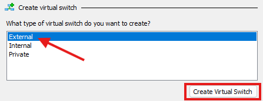
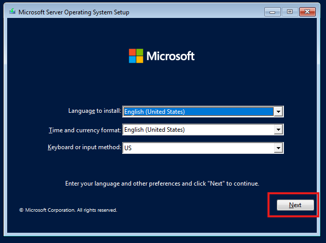
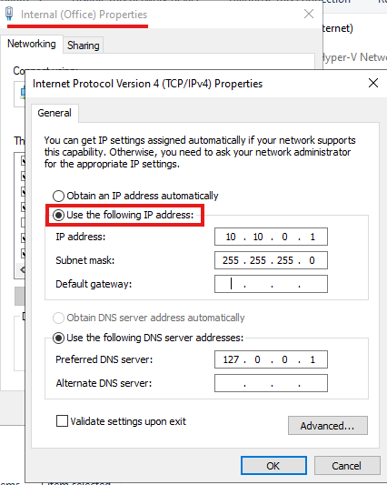

# Windows Server 2022 Active Directory Lab Setup

----

## 🧰 Requirements  

### **Host Machine Requirements** - [How to Enable Hyper-V](https://learn.microsoft.com/en-us/virtualization/hyper-v-on-windows/quick-start/enable-hyper-v)

To run the virtualized environment using **Hyper-V**, ensure your host machine meets the following requirements:  
- **Processor**: 64-bit CPU with **SLAT (Second Level Address Translation)** support.  
- **Memory**: 16 GB RAM (minimum).  
- **Storage**: At least 100 GB of free disk space for virtual machines.  
- **Operating System**: Windows 10/11 Pro or Enterprise (with Hyper-V enabled).  
- **Virtualization Support**: Enable virtualization in BIOS/UEFI.  

___

### **Windows Server 2022 VM Requirements** - [Download Windows Server 2022 ISO](https://www.microsoft.com/en-us/evalcenter/evaluate-windows-server-2022)

- **Processor**: 1.4 GHz 64-bit processor or higher.  
- **Memory**: 4 GB RAM (minimum).  
- **Storage**: 40 GB disk space (recommended for a lab environment).  
- **Network**: At least 1 virtual network adapter (internal or external).  

___

### **Windows 11 Client VM Requirements** - [Download Windows 11 ISO](https://www.microsoft.com/en-us/software-download/windows11)  

- **Processor**: 1 GHz dual-core 64-bit CPU.  
- **Memory**: 4 GB RAM (minimum).  
- **Storage**: 64 GB disk space (minimum).  
- **Graphics**: DirectX 12 compatible GPU / WDDM 2.0 driver.  
- **Network**: At least 1 virtual network adapter.  

---

# **1. Hyper-V Configuration**

*Assuming you have virtualization enabled already in your BIOS/UEFI settings. If not, you will need to enable it first through your system settings.*
Install **Hyper-V** on your host machine by following the steps in this guide: [Enable Hyper-V on Windows](https://learn.microsoft.com/en-us/virtualization/hyper-v-on-windows/quick-start/enable-hyper-v).  

---

# **2. Creating an Office & Internet vNIC**

In this step, we will create two virtual network interfaces (vNICs) in Hyper-V.
- The first, the Internet vNIC, will allow the server to access the internet and share connectivity with client devices.
- The second, the Office vNIC, will enable internal communication between the server and client devices within a private network.
- These vNICs will work together to simulate a real-world network, with the server acting as a gateway for internet access and managing internal office communications.

## **Step 2.1**  
In **Hyper-V Manager**, click on **`Virtual Switch Manager`**.  

  

## **Step 2.2**  
Select **`External`** for the type of switch and click **`Create Virtual Switch`**.  

  

## **Step 2.3**  
Name it appropriately (e.g., **External (Internet)**). For the connection type, select **`External`** and choose your physical NIC from the dropdown.  
*This vNIC will allow virtual machines to access the internet.*  

  

## **Step 2.4**  
To create the Office NIC, click **`New Virtual Network Switch`** and select **`Private`** for the type. Click **`Create`**.  
*Quick Tip:*  
- **External**: Connects VMs to your host machine and the internet.  
- **Internal**: Connects VMs to the host machine only (no internet).  
- **Private**: Connects VMs to each other but not to the host or the internet.  

  
  

## **Step 2.5**  
Name it appropriately (e.g., **Office vNIC**). For the connection type, select **`Private Network`** and click **`OK`**.  

  

---

# **3. Creating a Virtual Machine in Hyper-V**

In this step, we will create a new virtual machine in **Hyper-V** to serve as your **Windows Server 2022 Domain Controller**.

## **Step 3.1**  
In **Hyper-V Manager**, click **`New > Virtual Machine`**.  

  

## **Step 3.2**  
Enter a name for your virtual machine (e.g., **`Project-Server`**) and click **`Next`**.  

  

## **Step 3.3**  
Select **`Generation 2`** for the virtual machine and click **`Next`**.  
*Tip*: **Generation 2** supports modern hardware features like UEFI and Secure Boot, whereas **Generation 1** is compatible with older systems.  

  

## **Step 3.4**  
Assign **`4096 MB`** (4 GB) of memory to meet the minimum RAM requirement for Windows Server.  
Check **`Use Dynamic Memory`** to allow the server to adjust RAM usage based on demand.  

  

## **Step 3.5**  
Select the **Private (Office) NIC** you configured earlier for the virtual machine’s network connection.  

  

## **Step 3.6**  
Leave the virtual hard disk (VHD) settings as default, as the default capacity exceeds the minimum storage requirement for Windows Server.  

  

## **Step 3.7**  
Under **`Installation Options`**, choose **`Install an operating system from a bootable CD/DVD-ROM`**, then click **`Browse`** and select your saved **Windows Server 2022 ISO file**.  

  

## **Step 3.8**  
Review the VM summary to ensure all configurations are correct, then click **`Finish`** to create the virtual machine.  

  

---

# **4. Assigning the External & Internal NICs to the Server**

In this step, you will configure the virtual machine (VM) you just created by assigning the appropriate network interfaces:  
**Private (Office):** Used for internal communication between virtual machines.  
**External (Internet):** Enables internet access via the physical NIC.

## **Step 4.1**  
Right-click on the virtual machine you just created and select **`Settings`**.  

  

## **Step 4.2**  
Under **Network Adapter**, ensure the selected adapter is set to **Private (Office)**. Press **`OK`**.  

  

## **Step 4.3**  
Click **`Add Hardware`**, select **`Network Adapter`**, and press **`Add`** to add another network adapter.  

  

## **Step 4.4**  
Under the new **Network Adapter**, select **External (Internet)** as the network type. Ensure you now have two active vNICs:  
-**Private (Office):** Used for internal communication.  
-**External (Internet):** Enables internet access.  

  

---

# **5. Windows Server 2022 Installation**

In this step, we will install **Windows Server 2022** on the VM (**`Project-Server`**) you created earlier. This installation will prepare the server to function as the domain controller for your network.

## **Step 5.1**  
Right-click on your server VM (**`Project-Server`**) in **Hyper-V Manager** and select **`Connect`**. You will see a boot screen prompting you to boot from the CD/DVD. Follow the on-screen instructions to start the installation.  

  

## **Step 5.2**  
Configure the installation options (e.g., language, time, and keyboard preferences) to your liking and click **`Next`** to proceed with the installation.  

## **Step 5.3**  
For this project, choose **Standard Evaluation (Desktop Experience)** and click **Next**. The **Desktop Experience** option provides a user-friendly Graphical User Interface (GUI), making it easier to follow along and manage the server throughout the project.

*Quick Tip*:
- **Standard Evaluation**: A basic edition with limited features, suitable for small to medium-sized environments.  
- **Datacenter Evaluation**: A feature-rich edition designed for large-scale virtualization and enterprise data centers.  
- **Desktop Experience**: Includes a GUI for easier navigation and management.  
- **Non-Desktop Experience (Server Core)**: A minimal installation without a GUI, intended for advanced users who prefer command-line tools or remote management.

  

## **Step 5.4**  
Since this is a fresh installation, select **`Custom`** when prompted for the installation type.  

  

## **Step 5.5**  
Select the drive to install Windows Server 2022, click **`Next`**, and allow the installation to proceed.  

  

## **Step 5.6**  
After the installation is complete, you will be prompted to set a password for the built-in Administrator account. Enter and confirm the password. Once completed, you will be asked to log in using the password you just created.  

   

---

# **6. Initial Server Setup and Customization**

In this step, we will configure the initial basic settings for Windows Server 2022, including enabling network discovery, setting the time zone, and customizing the server name.

## **Step 6.1**  
After logging in with the administrator credentials, you will see a network pop-up asking if you want the PC to be discoverable. Click **Allow**.  

*Quick Tip*: 
- Allowing the server to be discoverable enables communication with other devices on the same network, which is essential for domain functionality.  

  

## **Step 6.2**  
Under **Local Server** in the left-hand menu of **Server Manager**, click on the time zone setting to update it.  

  

## **Step 6.3**  
Click **Change Time Zone** and select your desired time zone.  

  

## **Step 6.4**  
To rename the server, click on the default computer name (e.g., **WIN-M8MIVD6FLUD**) under **Local Server**.  

  

## **Step 6.5**  
In the new window that appears, under **Computer Name**, click **Change**. Enter your desired computer name (e.g., **Project**) and press **OK**.  

    

---

# **7. Configuring and Identifying Network Interfaces (NICs)**

In this step, we will identify the server’s network interfaces (NICs) and configure the Internal (Office) NIC with a static IP address to ensure reliable communication within the private network. The External (Internet) NIC will remain configured to use DHCP to automatically obtain an IP address from the router for internet connectivity.

## **Step 7.1**  
Under **Local Server** in **Server Manager**, click on one of the **`IPv4 address assigned by DHCP, IPv6 enabled`** links. This will open the **Network Connections** window.  

  

## **Step 7.2**  
In the **Network Connections** window, you will see two Ethernet connections. To identify which is internal and which is external, right-click each NIC, select **Status**, and then click **Details**.  

## **Step 7.3**  
In the **Network Connection Details** window:  
- **Ethernet**: Displays an address like `169.254.x.x`, which is an APIPA address. This indicates the NIC is likely the **Internal NIC**, as it could not get an IP address from the router via DHCP.  
- **Ethernet 2**: Displays an address like `192.168.x.x`, assigned by the router via DHCP, making it the **External NIC**.   

- Rename the NICs accordingly (e.g., **Internal (Office)** and **External (Internet)**) to track their roles. 

  

## **Step 7.4**  
Now that the NICs are identified, assign a static IP address to the **Internal (Office)** NIC. Right-click the renamed NIC, select **Properties**, then select **Internet Protocol Version 4 (TCP/IPv4)** and click **Properties**. 

*Quick Tip*: 
- Assigning a static IP ensures consistent network communication within the domain, as the address won’t change like it might with DHCP.  

 

## **Step 7.5**  
In the IPv4 settings, change from **`Obtain an IP address automatically`** to **`Use the following IP address`**. Enter the following:  
- **IP Address**: `10.10.0.1`  
- **Subnet Mask**: `255.255.255.0`  
- **Default Gateway**: Leave this blank.  
- **DNS Server**: Use either `10.10.0.1` (server IP) or `127.0.0.1` (loopback address).
 
*Quick Tip*:
- The loopback address (`127.0.0.1`) allows the server to resolve its hostname without querying an external DNS server.  

## **Step 7.6**  
The **External (Internet)** NIC is already set to receive an IP address via DHCP from the router. No further configuration is needed for this NIC.  

  
